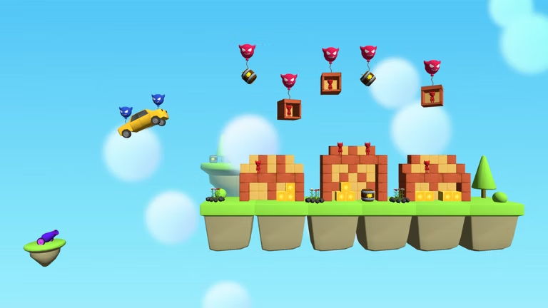

# Бумбарда ([SberApps](https://apps.sber.ru/salute-apps/3f799e32-4a76-41f9-9279-9390447b0b4c/))

77 лет назад враг захватил власть в прекрасном мире Летающих островов, а народ населяющий этот мир вынужден был его покинуть. Долгие годы мастера трудились над созданием грозного оружия - Бумбарды.
Только оно способно дать отпор дерзкому завоевателю.
Возьми под управление Бумбарду и уничтожь противника любой ценой!

<iframe width="525" height="295" src="https://www.youtube.com/embed/yflk7eiXiVA" title="Бумбарда" frameborder="0" allow="accelerometer; autoplay; clipboard-write; encrypted-media; gyroscope; picture-in-picture; web-share" referrerpolicy="strict-origin-when-cross-origin" allowfullscreen></iframe>

---

## Интересные моменты

- Данная игра является логичным продолжением проекта [What a Blast](./what_a_blast.html), подготовленным для приставок Sber Devices.
- Реализовано совершение покупок для открытия дополнительных уровней в игре.
