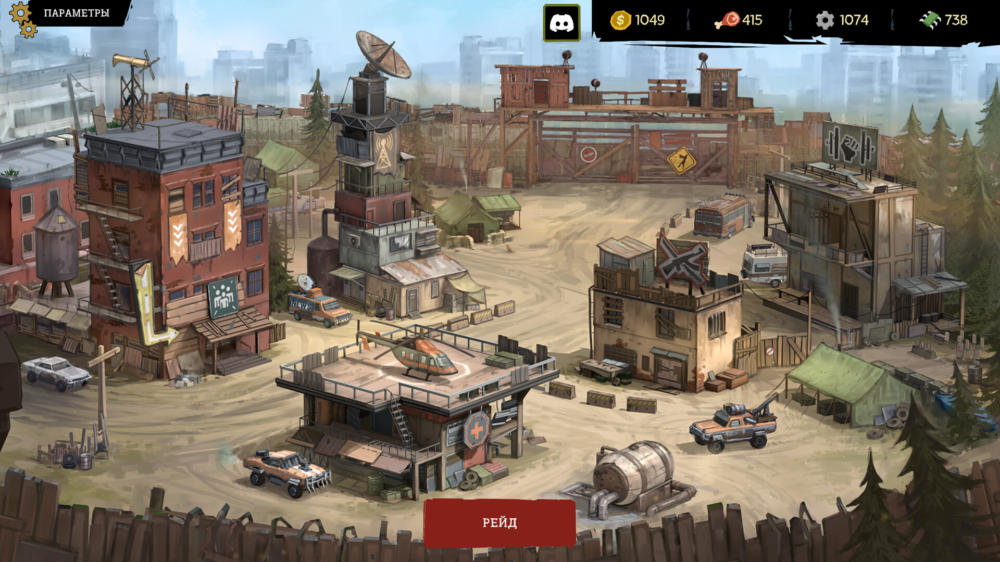
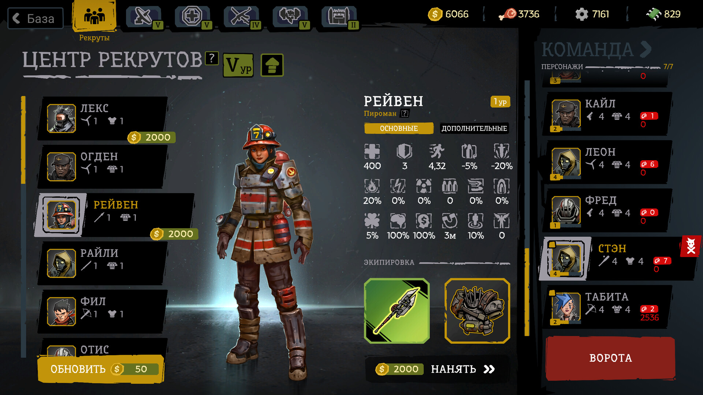
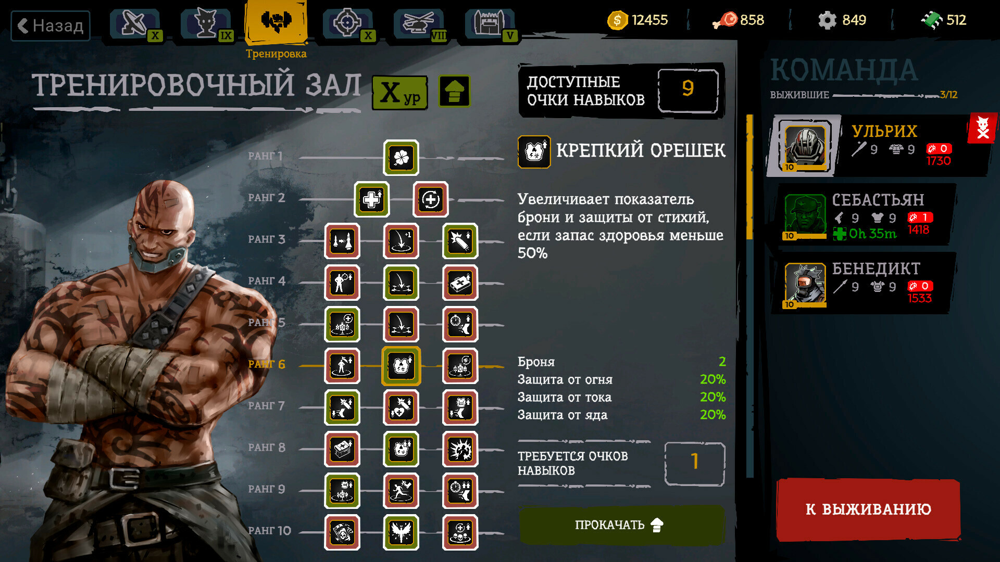
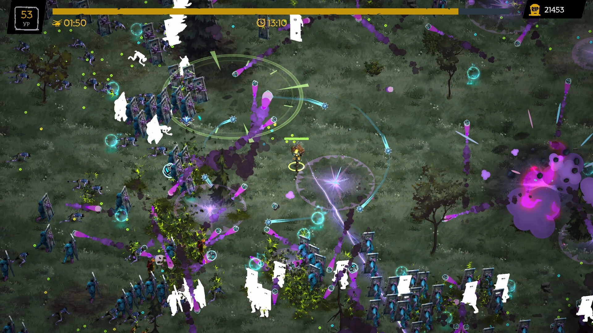
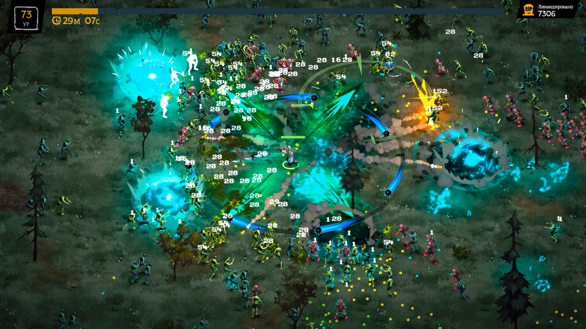
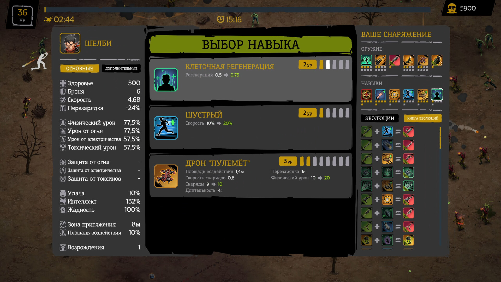

# FatalZone ([Steam](https://store.steampowered.com/app/2488510/FatalZone/))

*Выживание требует жертв…*

Уничтожай орды зомби в мире, разрушенном эпидемией страшного вируса, и добывай ресурсы для одной из последних баз выживших. FatalZone — это автошутер с элементами рогалика и RPG, в котором ты усиливаешь базу и отправляешь наемников в смертельные вылазки. И все ради того, чтобы спасти человечество.

<iframe width="560" height="315" src="https://www.youtube.com/embed/AZSyT523SDQ" title="FatalZone Trailer" frameborder="0" allow="accelerometer; autoplay; clipboard-write; encrypted-media; gyroscope; picture-in-picture; web-share" allowfullscreen></iframe>

---

## Интересные моменты

- В основе архитектуры Core-геймплея лежит подход ECS с использованием фреймворка [Morpeh](https://github.com/scellecs/morpeh).
- В игре используется особый пайплайн по созданию 2D-анимаций персонажей и врагов:
    - 3D-моделлеры создавали полноценные модели, рендерили анимации в секвенции спрайтов в разных ротациях и передавали для интеграции.
    - Далее, уже в движке Unity, с помощью написанных кастомных инструментов редактора тысячи новых спрайтов автоматически разбивались на нужные подпапки по ротациям, создавались нужные префабы и файлы анимаций, все напонялось спрайтами и настраивалось, а из спрайтов создавались атласы.
- Для баланса практически всех игровых параметров настроена синхронизация с таблицами Notion. При изменении каких-либо данных в таблицах можно обновлять все прямо в билде, что существенно упрощает работу гейм-дизайнерам.
- Для комбинаторики десятков параметров у сотен навыков создан специальный алгоритм, высчитывающий все без каких-либо задержек и ошибок.
