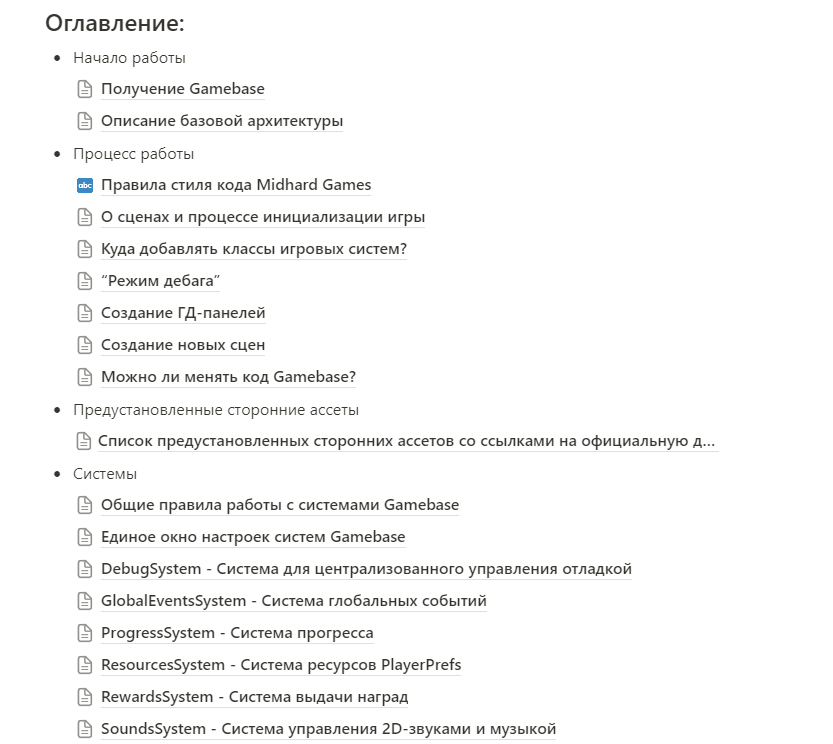
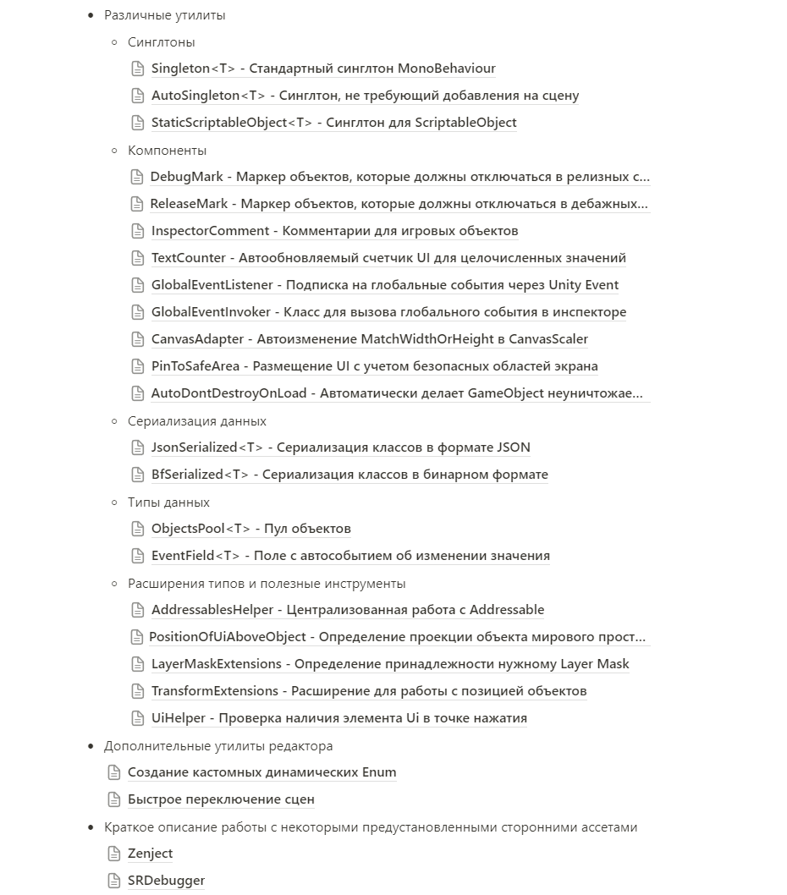
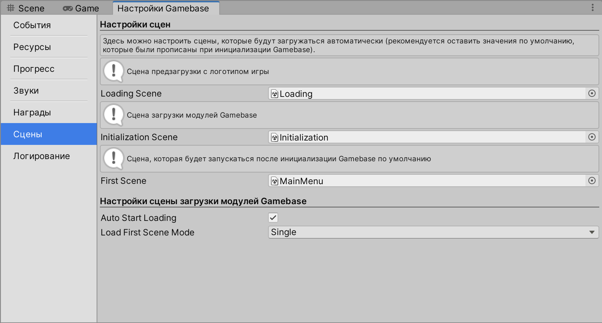

# Gamebase

Gamebase существует для обобщения подходов к разработке игр внутри студии, упрощения перехода разработчиков из одного проекта в другой, ускорения разработки прототипов и улучшения конечного качества долгосрочных проектов, создаваемых на его основе.

Он включает в себя набор абстрактных систем, готовых к работе, ряд предустановленных ассетов, а также множество небольших классов и компонентов.

---

## Интересные моменты

- Gamebase с момента первых версий и до сих пор используется разработчиками студии как основа для любого нового проекта на Unity. У него есть отдельные версии для Hyper Casual проектов и проектов на архитектуре ECS.
- Небольшая доля систем, которые содержит Gamebase: система игрового цикла, система централизованной отладки, система глобальных событий, система прогресса, система ресурсов, система выдачи наград, система 2D звука, автоматизированная ГД панель на атрибутах, шаблонный интерфейс, система динамических перечислений.
- Gamebase также содержит сторонние утилиты, используемые студией в качестве стандарта: Doozy UI, Zenject и др.
- Gamebase содержит шаблон стандартной архитектуры, состояющую из нескольких предустановленных и изолированных друг от друга библиотек (Assembly Definition) с заранее установленными правилами связей между ними, а также собственный принцип организации логики интерфейса “GCE” (Gameplay ← UIControllers → UIElements).
- Gamebase позволяет сразу же начать работу над новым проектом, имея в распоряжении уже готовые необходимые системы и утилиты.
