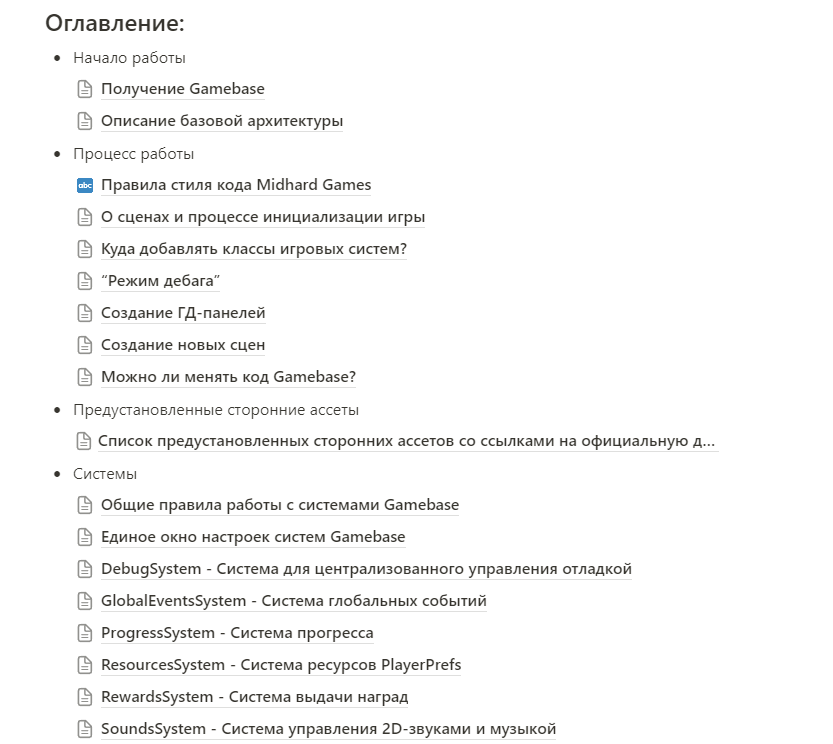
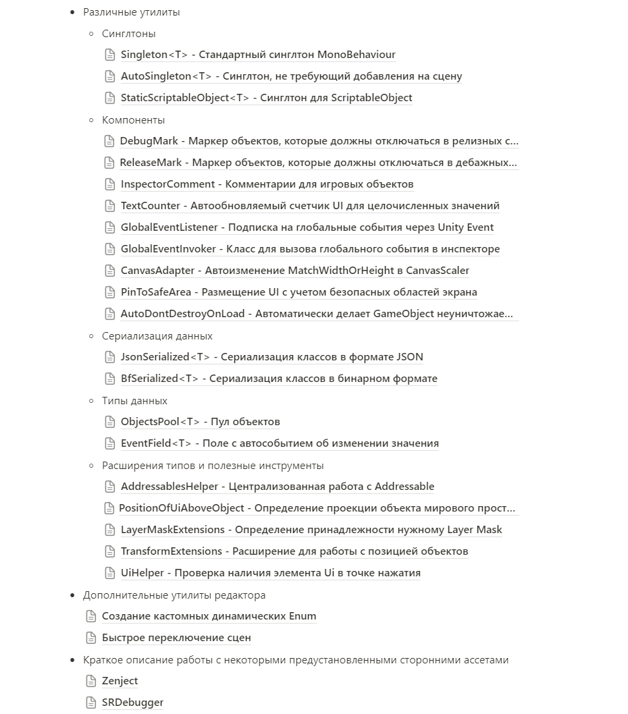

# Gamebase

Gamebase существует для обобщения подходов к разработке игр внутри студии, упрощения перехода разработчиков из одного проекта в другой, ускорения разработки прототипов и улучшения конечного качества долгосрочных проектов, создаваемых на его основе.

Он включает в себя набор абстрактных систем, готовых к работе, ряд предустановленных ассетов, а также множество небольших классов и компонентов.

