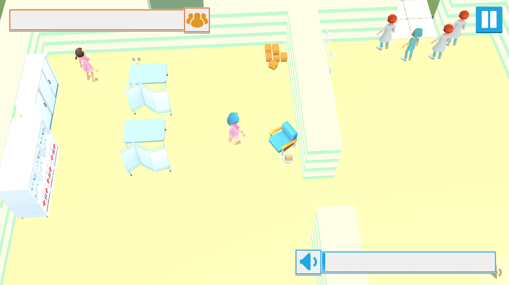
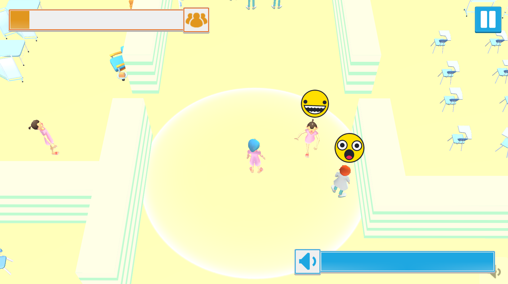
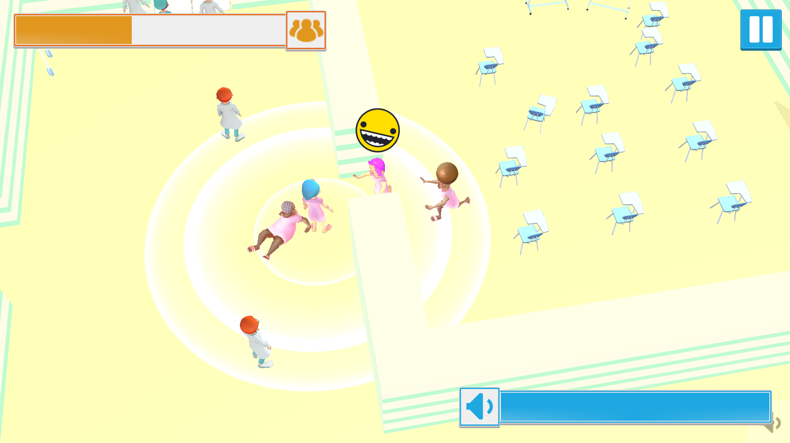

# Hullabaloo

Ты! Да, ты, за экраном, посмотри на этих сумасшедших. Они очень не любят шум. Покричи немного и, может быть, санитары отвлекутся на буйных, а ты сможешь убежать!

<iframe width="525" height="295" src="https://www.youtube.com/embed/2JQlNJpAR0k" title="Hullabaloo" frameborder="0" allow="accelerometer; autoplay; clipboard-write; encrypted-media; gyroscope; picture-in-picture; web-share" referrerpolicy="strict-origin-when-cross-origin" allowfullscreen></iframe>

---

## Интересные моменты

- Игра создана для тестирования возможности использования микрофона смартфона в игровом процессе.
- Немножечко безумия и авторская озвучка 🤪