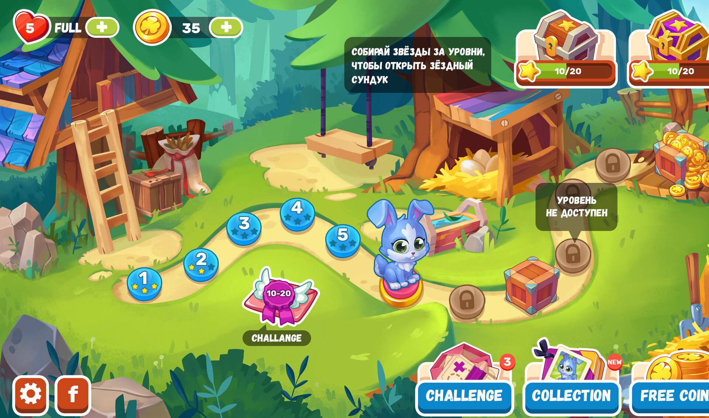
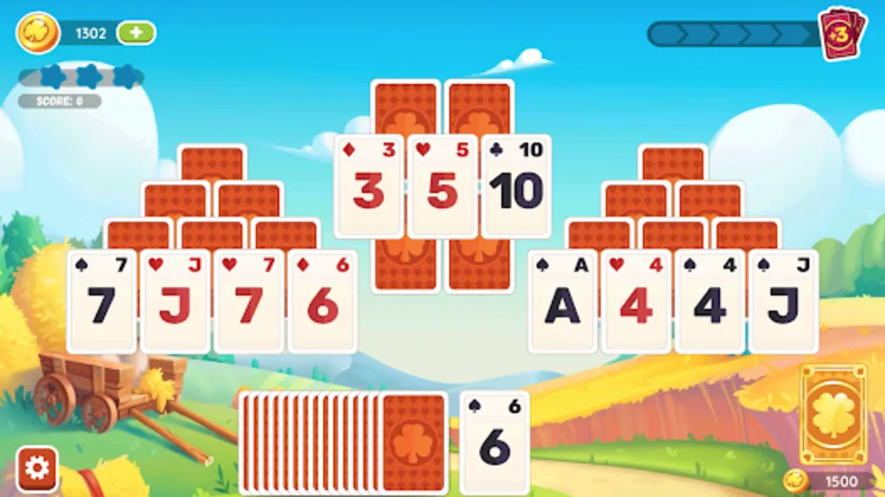
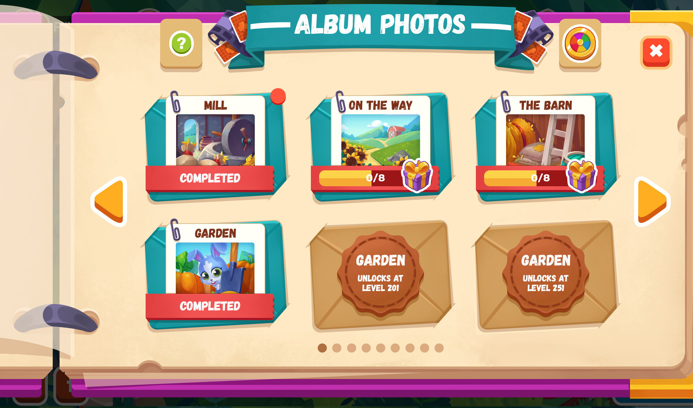
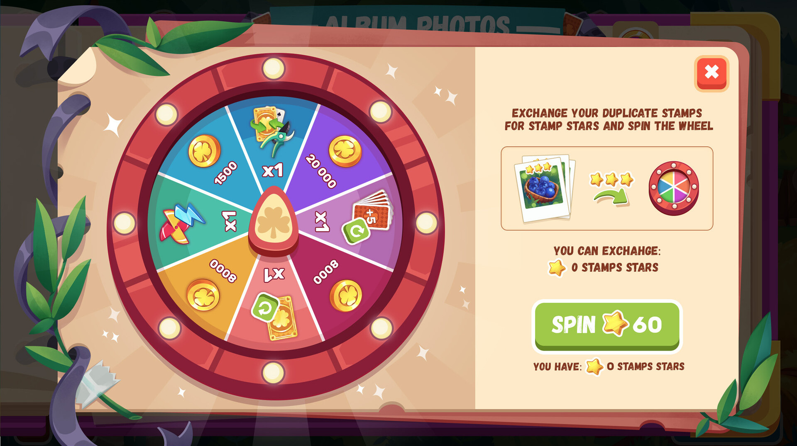
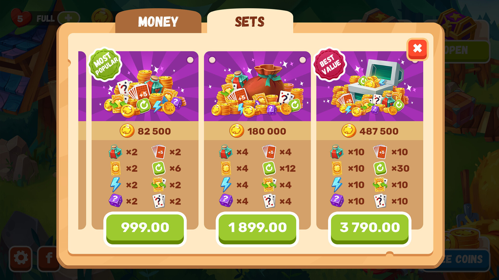

# Solitaire Tripeaks

Совершенно новый пасьянс, полный забавных головоломок, с множеством уровней с крутой графикой и атмосферой приключений! Играйте в пасьянс и отправляйтесь в увлекательное путешествие по новому миру!

<iframe width="568" height="282" src="https://www.youtube.com/embed/bJS8xOtmW7A" title="TriPeaks Cards: Solitaire Game" frameborder="0" allow="accelerometer; autoplay; clipboard-write; encrypted-media; gyroscope; picture-in-picture; web-share" referrerpolicy="strict-origin-when-cross-origin" allowfullscreen></iframe>

---

## Интересные моменты

- В проекте была реализована система "ловушек", позволяющая подводить игроков к требуемым ситуациям в ходе игры на любом уровне. Алгоритмы ловушек работали адаптивно и гарантировали возникновение ситуаций, настроенных левелдизайнером.
- В игру интегрировано несколько сервисов аналитики, в том числе AppMetrica, с помощью которой была реализована иерархическая система событий, позволяющая в деталях анализировать поведение игроков на любых уровнях и сценах, как в среднем среди больших групп игроков, так и для каждого уникального игрока (в обезличенном виде).
- Практически все анимации в игре реализованы с помощью DOTween.
