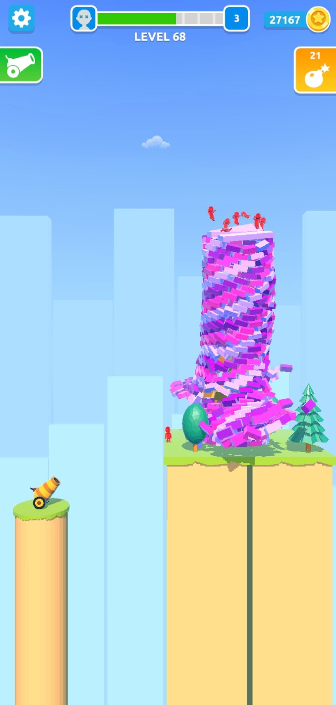
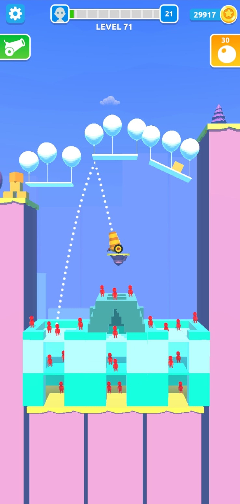
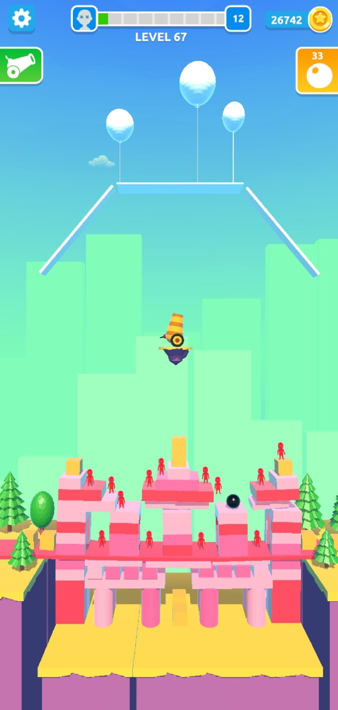
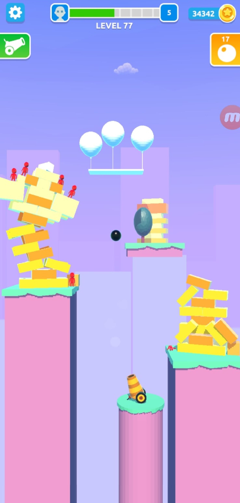
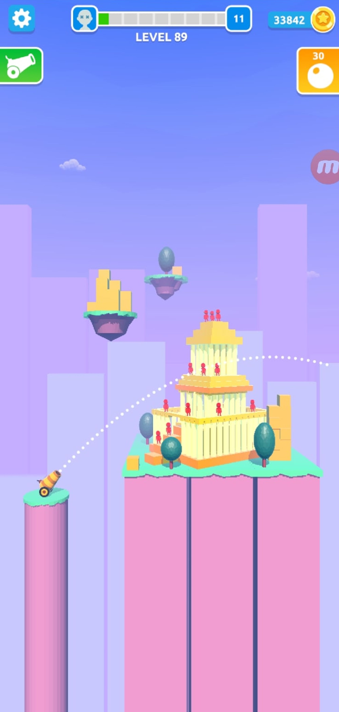

[<Назад](./)

# What a Blast

Аркадная головоломка с элементами физики, схожая с играми серии Angry birds. У игрока есть пушка, из которой он стреляет по зданиям. Задача каждого уровня - уничтожить противников за отведенное количество выстрелов. Противники находятся в зданиях, которые состоят из блоков.

<iframe width="560" height="315" src="https://www.youtube.com/embed/Vd85Ph4ym3k" title="YouTube video player" frameborder="0" allow="accelerometer; autoplay; clipboard-write; encrypted-media; gyroscope; picture-in-picture; web-share" allowfullscreen></iframe>

---
