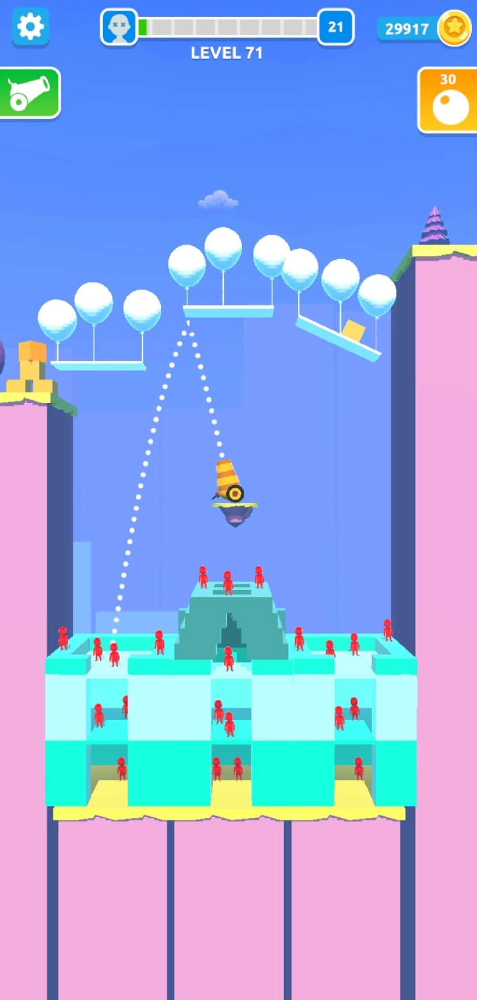
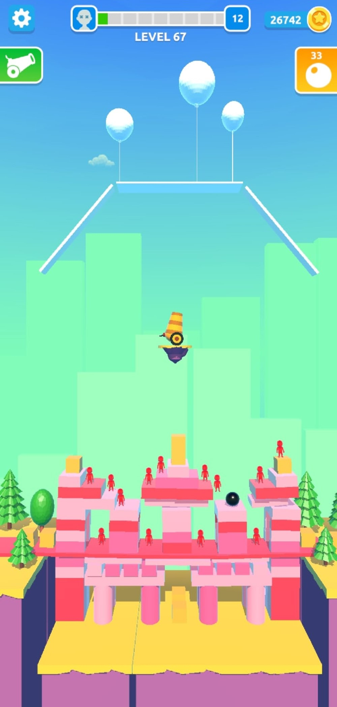

# What a Blast

Аркадная головоломка с элементами физики, схожая с играми серии Angry birds. У игрока есть пушка, из которой он стреляет по зданиям. Задача каждого уровня - уничтожить противников за отведенное количество выстрелов. Противники находятся в зданиях, которые состоят из блоков.

<iframe width="560" height="315" src="https://www.youtube.com/embed/Vd85Ph4ym3k" title="What a Blast Gameplay" frameborder="0" allow="accelerometer; autoplay; clipboard-write; encrypted-media; gyroscope; picture-in-picture; web-share" allowfullscreen></iframe>

---

## Интересные моменты

- Рисование траектории движения снарядов учитывает столкновения с препятствиями. Для этой механики осуществляется виртуальный запуск снарядов в невидимой копии мира, записываются координаты точек, которые пролетает снаряд, после чего траектория отображается игроку по координатам. Этот процесс производится постоянно, но мгновенно и незаметно для игрока.
- Для левел-дизайнеров были подготовлены удобные инструменты для быстрого конструирования уровней с привязкой доступных блоков друг к другу.
