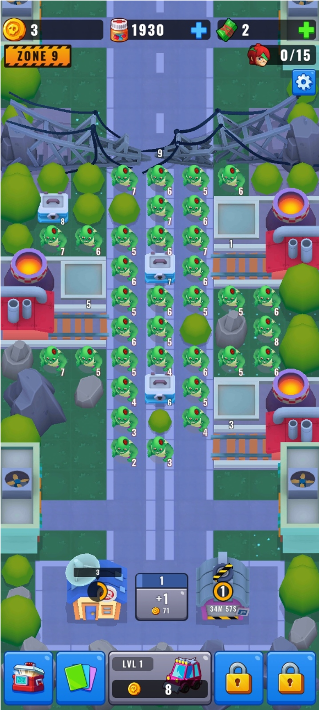
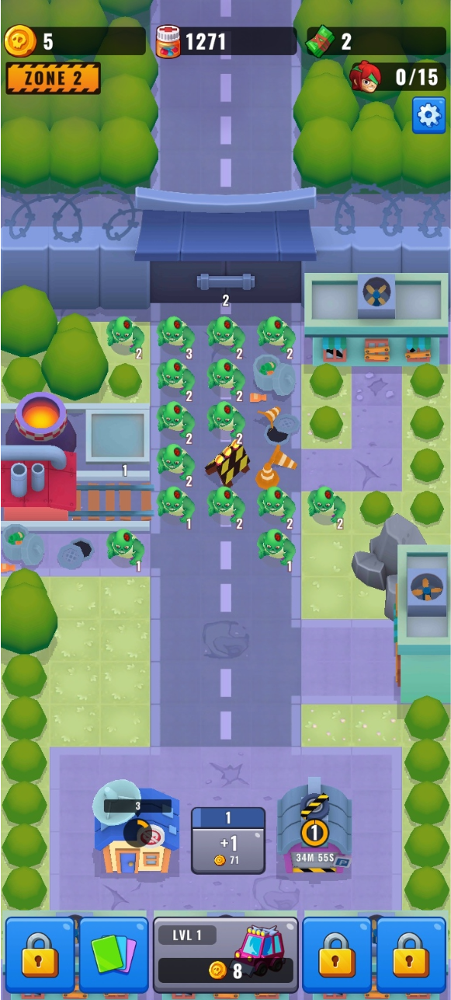
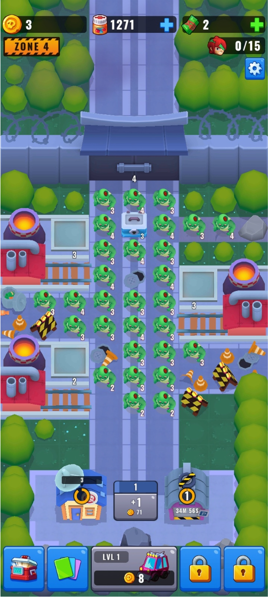

# Zombie Counter Game

Айдлер, в котором предстоит столкнуться лицом к лицу с ордами зомби.

<iframe width="568" height="282" src="https://www.youtube.com/embed/XH_JHKk-H8g" title="ZCG Gameplay" frameborder="0" allow="accelerometer; autoplay; clipboard-write; encrypted-media; gyroscope; picture-in-picture; web-share" referrerpolicy="strict-origin-when-cross-origin" allowfullscreen></iframe>

---

## Интересные моменты

- Было реализовано несколько видов персонажей с разными боевыми способностями.
- Боевая система написана с использованием фреймворка [LeoECS Lite](https://github.com/Leopotam/ecslite).
- Для работы с большими (огромными) числами в игре был создан свой тип данных на основе Big Integer.
